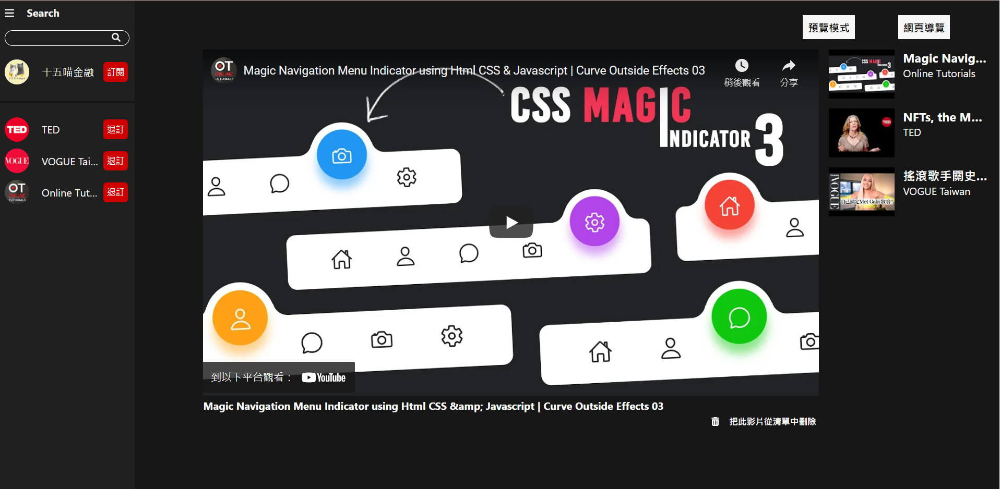

# YouTube 頻道 新影片自動撥放器

此專案部屬在 Heroku 免費方案上，第一次載入 Heroku 需開機約 3~5 秒 [連結](http://youtube-new-video-auto-player.herokuapp.com/).

## 專案簡介

### 專案概念

平時在使用 YouTube 時，因為訂閱太多頻道與推薦影片太雜，時常需要自己到想看的頻道查看是否有上新影片，或是一不留神就一部又一部的看著推薦影片，花掉了許多寶貴時間。

因此我做了這個網站來嘗試解決這個問題，並練習 `React` 與 [其他相關套件](#使用的技能)

網站的主要功能是幫您檢查訂閱頻道是否有新影片，並集合成列表讓您觀看。其中「搜尋頻道」與「檢查是否有新影片」兩個功能需要透過 YouTube API 取得 ( 寫在後端 Express 中 )

### 基本功能

* 您可以在網站中搜尋並訂閱 YouTube 的頻道，網頁會自動整理頻道的最新一部影片，集合成播放清單。

* 網頁依照播放清單的順序播放影片，您也可以點擊播放清單的影片改變播放順序。

* 當您看完影片或是點擊右下角的「把此影片從清單中刪除」，影片便會從清單中被移除。下次該頻道有新影片便會再加入清單。

>YouTube API 每天大概只有 100 次的配額，因此我限制每個頻道至少每 8 小時更新一次，
並且在主頁右上角，點擊「預覽模式」按鈕，則會出現假資料來方便查看網頁的大致切版。

### 使用的技能

* React  
專案主要分為三個大元件「SideBar 側邊欄」、「VideoBar 影片列表」、「VideoPlayer 影片撥放器」，練習以「區分功能」和「可複用」兩原則來劃分元件做開發。

* Redux  
由於「訂閱列表」與「影片列表」兩個 Array 會在多個元件與子元件中使用與修改，因此加入 Redux 將兩個 Array 抽出來個別管理狀態。

* react-router-dom  
因專案只有一個簡單的純文字分頁，因此採用 React Router 來做分頁，並以 Link 做鏈結。

>Link 功能並不會刷新頁面，回前頁若用 Link 則會導致影片列表錯誤的重複渲染，因此回前頁用的是 a 標籤

* axios  
使用 axios 來處理 http request ，並且參考 [使用Axios你的API都怎麼管理？](http://youtube-new-video-auto-player.herokuapp.com/) 作者: Mike  
將 API 集中管理在 api.js 中，這樣不僅使用到的 API 一目了然，在做修改時也只需修改一處，是非常好的寫法。

* styled-components  
由於 css 以物件方式寫在 React 中太亂了，因此加入 styled-components 來處理 css，也可以在 styled-components 中使用 visited、hover 等互動偵測，更可以使用跟 React component 一樣的傳入值 props 來改變 css。

* Express  
由於 YouTube API 在前端要求會有跨域 ( CORS ) 問題，因此以 JavaScript 的 Express 來當作伺服器要求 YouTube API ，並開 API 給前端使用。同時也作為專案的後端，加入打包的 React 後部屬到 Heroku 上。

>若您的文章鏈結不希望被分享，請聯繫我 ( jiehengwork@gmail.com )，我會馬上撤下，謝謝您！